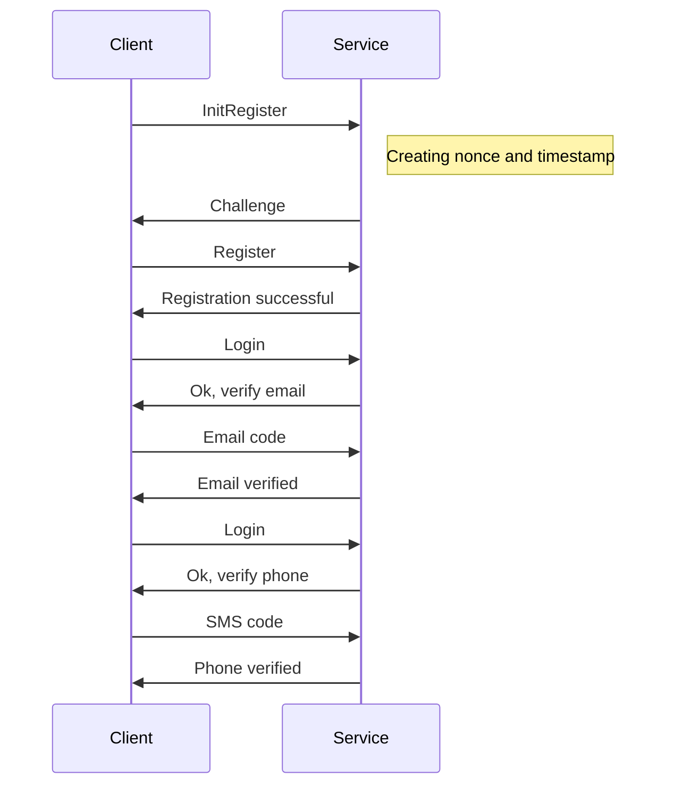
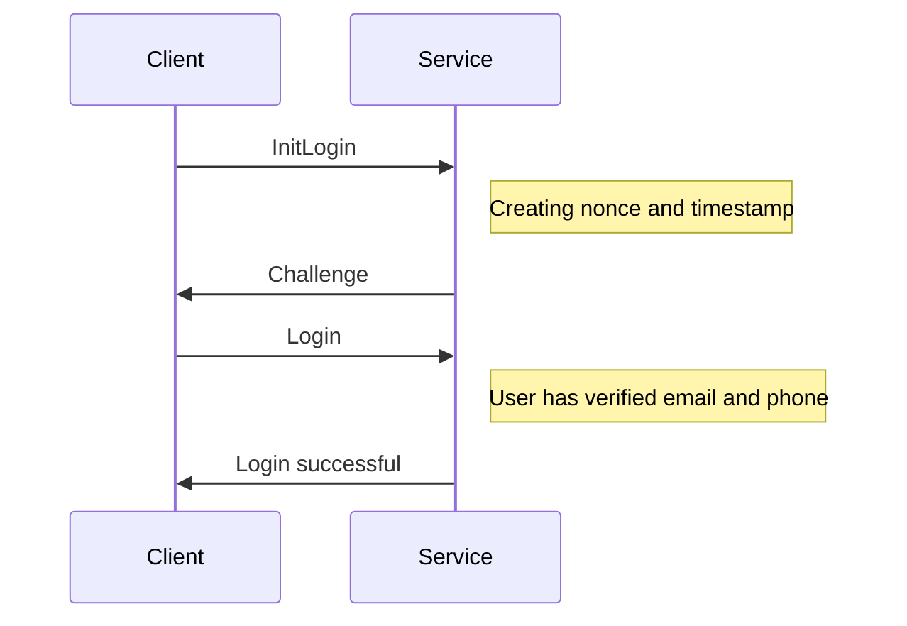
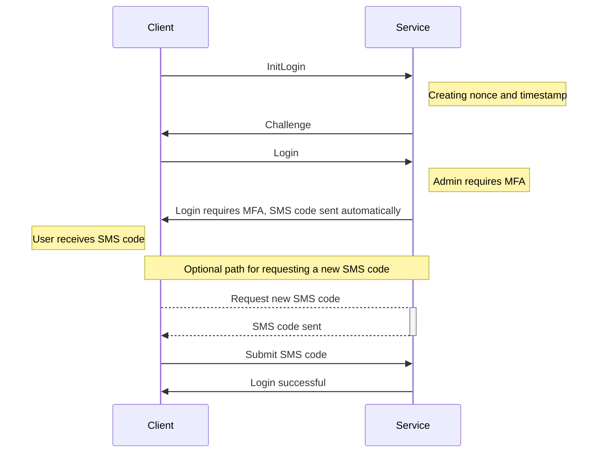

# ISECure Python Client — Beta

This is a client side SDK for interacting with ISECure banking file exchange REST API.

**Status: Beta.**

> The OpenAPI specification for the REST API service this client interacts with is in the linked [wsapi_v2.json](https://www.isecure.fi/wsapi_v2.json) file.

## Install from GitHub

Use Python 3.10–3.12. The current PGP dependency does not support Python 3.13+.

```sh
python -m pip install "isecure-client @ git+https://github.com/isecurefi/isecure-py-client.git"
```

This is the initial 0.1.0 source release. Installation from GitHub is the
supported instruction here; this repository does not establish a PyPI release.

## Current coverage

The client implements registration, challenge-response login, SMS MFA, phone/email
verification, PGP key upload, file upload and file listing, plus local PGP signing
and verification. It is synchronous and uses an interaction handler for prompts.
It does not yet match the TypeScript SDK: TOTP enrollment/factor selection,
certificate operations, file download/deletion, account administration and logout
are not implemented. See the [TypeScript SDK](https://github.com/isecurefi/isecure-ts-client)
for broader API coverage. No current end-to-end bank qualification is claimed.

## Example

See [examples/full_workflow.py](examples/full_workflow.py). It performs registration,
PGP key upload and file upload against the test API; running it changes that account.
Set `ISECURE_API_KEY`, `ISECURE_COMPANY`, `ISECURE_NAME`, `ISECURE_PASSWORD`,
`ISECURE_PHONE` and `ISECURE_EMAIL` in your environment. Use your verified tenant API
key for an existing tenant. The initial owner registration can use `0`; reuse the
returned API key for subsequent registrations.

Set `ISECURE_PGP_PUBLIC_KEY_FILE` and `ISECURE_PGP_PRIVATE_KEY_FILE` to your own
local PGP key files. No private keys or account credentials are distributed.
`test.pem` and `prod.pem` are the API's public RSA encryption keys, not private keys.
Never commit your credentials or private keys. Test access and bank connections
must be provisioned separately; registration does not grant paid product access.

## Development

```sh
python -m venv .venv
. .venv/bin/activate
python -m pip install -e ".[dev]"
python -m pytest
```

Tests generate disposable PGP keys in memory and make no bank API calls.

## License

MIT; see [LICENSE](LICENSE).

## APPENDIX: Message Sequence Charts

### Registering User Example

Example for registering to ISECure SaaS Bank API service test environment.



### Login Example (Data User)

Example of login flow for a data user when both email and phone are already verified.



### Login Example (Admin User with MFA)

Example of login flow for an admin user requiring MFA with SMS verification.


